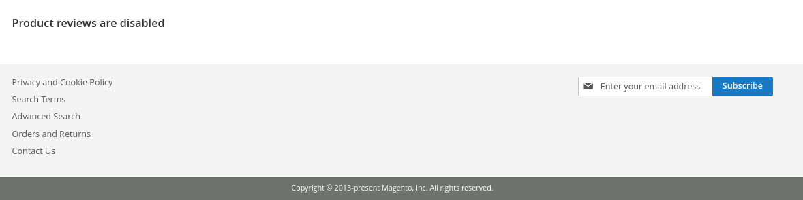

# Techshop Custom Product Review Module

 - [Features](#features)
 - [Installation](#installation)
 - [Configuration](#configuration)
 - [Tests](#tests)
 - [Screenshots](#screenshots)

## Features
 - Enable/Disable custom form Customer Product Review feature

## Installation
### Zip file
 - Unzip the zip file in `app/code` ;
 - The folder structure after unzip should look like: `app/code/Techshop/ProductReview`
 - Run `php bin/magento module:enable Techshop_ProductReview` to enable module;
 - Run `php bin/magento setup:upgrade` ;
 - Flush cache with running `php bin/magento cache:flush` ;

## Configuration
### Store Configuration
 - Go to the configuration path: `Stores -> Settings -> Configuration -> Techshop -> Customer Product Review`;
 - Enable the feature;
 - Clear the cache to reflect the changes: `System -> Tools -> Cache Management -> Flush Magento Cache`;

 ## Tests
 - With the module enabled, perform a review on the product page.
 - This new review will be available for approval in Techshop -> All Reviews
 - Select the revisions you want to approve using the mass actions in the admin grid.
 - If approved, it should appear on the product page, in Reviews

 ## Screenshots
 ### Tab menu
 

### Configuration
 
 

 ### All Reviews
 
 
  ### All Reviews - Mass Action
 
 
 
 ### Frontend Form
 

  ### Frontend Form whit Feature Disabeld
 
 